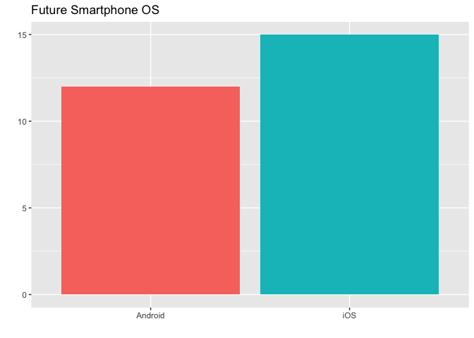
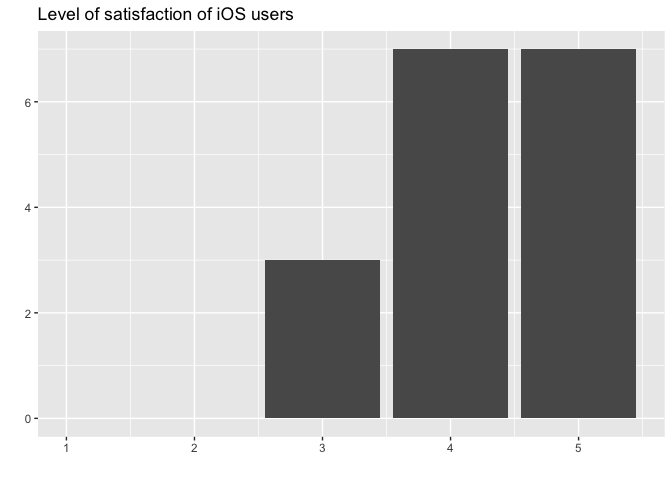
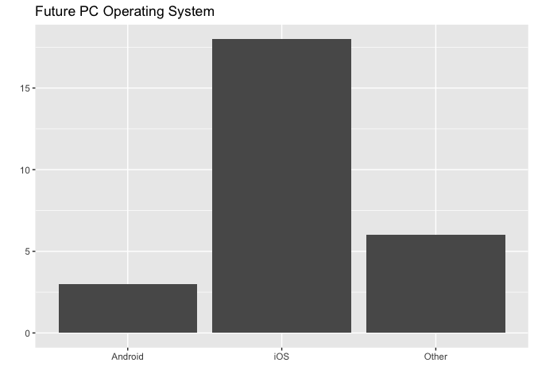

# An investigation into the relationship between peoples smartphone choices and their laptop choices.

## Background

The smartphone operating system industry is dominated by iOS and Android
and the laptop operating system industry is dominated by Mac OS and
Windows (also Linux, but for the purposes of this investigation it falls
under ‘Other’), we want to see if having there is any relation between
the phones that people own and their PC operating system choices.

Our hypothesis is that the choice of phone will influence the choice of
laptop in the individuals. For example, people with an iPhone will have
a non-negligible preference for purchasing/owning a Mac, and people with
an Android will edge towards a Windows or Linux OS.

## Survey

Online Survey Link: https://form.simplesurvey.com/f/s.aspx?s=ab0d4727-1bfa-492b-a658-603160a2d84f&lang=EN

## Reading the data

We asked our respondents a series of questions related to their
smartphones and PCs that included their level of satisfaction and the
type of OS required at the work. The columns are outlined below

  - **smartphone\_OS**: The type of smartphone that they currently own
  - **num\_smartphone\_OS**: Level of satisfaction with smartphone
  - **smartphone\_OS\_years**: Number of years they’ve owned the
    smartphone
  - **pre\_smartphone\_OS**: The smartphone that was owned before the
    current one
  - **future\_smartphone\_OS**: The smartphone they would purchase today
    if they had the choice
  - **family\_smartphone\_OS**: The smartphone OS that is most common
    amongst their family
  - **friend\_smartphone\_OS**: The smartphone OS that is most common
    amongst their friends
  - **PC\_OS**: The PC/Laptop operating system they are currently
    running
  - **num\_PC\_OS**: Level of satisfaction with PC
  - **PC\_OS\_years**: How long they’ve owned their current laptop/PC
  - **future\_PC\_OS**: The PC/Laptop OS they would purchase today if
    they had the choice
  - **workplace\_PC\_OS**: The PC/Laptop OS that is required by their
    workplace

Below, we show a snippet of the first six rows of our data, that is read
into our analysis
pipeline.

| smartphone\_OS | num\_smartphone\_OS | smartphone\_OS\_years | pre\_smartphone\_OS | future\_smartphone\_OS | family\_smartphone\_OS | friend\_smartphone\_OS | PC\_OS | num\_PC\_OS | PC\_OS\_years | future\_PC\_OS | workplace\_PC\_OS     |
| :------------- | ------------------: | --------------------: | :------------------ | :--------------------- | :--------------------- | :--------------------- | :----- | ----------: | ------------: | :------------- | :-------------------- |
| iOS            |                   5 |                     3 | iOS                 | iOS                    | iOS                    | iOS                    | MacOS  |           5 |             1 | iOS            | Either/Doesn’t Matter |
| Android        |                   3 |                     3 | iOS                 | Android                | iOS                    | iOS                    | MacOS  |           4 |             4 | iOS            | Windows               |
| iOS            |                   4 |                     2 | iOS                 | iOS                    | Android                | iOS                    | MacOS  |           4 |             1 | Other          | Mac OS                |
| iOS            |                   3 |                     2 | iOS                 | iOS                    | iOS                    | iOS                    | Other  |           3 |             1 | iOS            | Windows               |
| iOS            |                   4 |                     3 | iOS                 | iOS                    | iOS                    | iOS                    | MacOS  |           3 |             1 | iOS            | Either/Doesn’t Matter |
| Android        |                   3 |                     2 | Android             | Android                | Android                | iOS                    | MacOS  |           5 |             3 | iOS            | Either/Doesn’t Matter |

## Exploratory Analysis

First, let’s create some summary tables of the responses to see what
kind of a spread we’ve got.

#### Smartphone OS counts

| Smartphone OS | Count |
| :------------ | ----: |
| Android       |    10 |
| iOS           |    17 |

#### Laptop OS Counts

| PC OS   | Count |
| :------ | ----: |
| MacOS   |    16 |
| Other   |     1 |
| Windows |    10 |

Now, we decided to look at the **number of combinations between
smartphone and PC OS**

| Smartphone OS | PC OS   | Count |
| :------------ | :------ | ----: |
| Android       | MacOS   |     4 |
| Android       | Windows |     6 |
| iOS           | MacOS   |    12 |
| iOS           | Other   |     1 |
| iOS           | Windows |     4 |

#### Smartphones

Let’s take a closer look at the Smartphones category

<!-- -->

Looking at the level of satisfaction that iOS users reported

<!-- -->

And the level of satisfaction that Android users reported

<!-- -->

There appears to be a little more dissatisfaction with their current
smartphone OS amongst the Android group. The iOS group on the other hand
is robust with their satisfaction with their phones OS; with almost all
responses in the 4 or 5 range.

Let’s see if this translates into what future phones they might
purchase.

<!-- -->

Interestingly enough, Android saw a slight increase in the desired
smartphone OS category compared to iOS.

#### Laptop OS

Now let’s take a closer look at the Laptop OS category

<!-- -->

Looking at the level of satisfaction that MacOS users reported out of
five,

<!-- -->

And the level of satisfaction reported by Windows users

<!-- -->

Similarly to the Android group above, the Windows group shows a little
bit of a lower satisfaction overall with their current OS than the MacOS
group.

#### Combinations of Smartphone,Laptop OS

Finally, looking at a bin2d graph of the current smartphone platforms
vs. the current laptop platforms.

<!-- -->

Clearly as the iOS, MacOS syndicate is the most represented, it is the
lightest on the graph. Our outliers, the cross-platform users, are
poorly represented amongst this sample, but still non-negligible.
