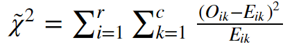

# Milestone 1: Proposal

### Research Question
The survey is designed to investigate a research question: Does the choice of phone of an individual influence their choice of laptop operating system?

### Survey Questions
Q0: Do you own a smartphone?
- Yes
- No

> This question identifies a confounding variable: Whether someone has a smartphone or not (Categorical)
> An individual has a personal smartphone may indicate that their potential interest toward technology, which also influence their choice of laptop.

Q1: What smartphone operating system/platform do you have?
- Android
- iOS
- Other

> This question identifies the independent variable in our analysis: Smartphone operating system

Q2: What is your level of satisfaction using your current phone?
1 - 2 - 3 - 4 - 5

> This question identifies a confounding variable: Someone's satisfaction level toward their phone operating system (Numerical)
> Someone satisfaction level toward their phone operating system can influence their choice of both smartphone and laptop operating systems.

Q3: What was your previous smartphone platform?
- Android
- iOS
- Didn’t have a phone before

> This question identifies a confounding variable: Someone's previous smartphone operating system(Categorical)
> Someone keep using the same operating system on their phone indicates that they are used to the system, and they are less likely to change the systems on their smartphone and laptop.

Q4a: What is the most common phone within your family?
- Android
- iOS
- Other

Q4b: Whats the most common phone within your friend group?
- Android
- iOS
- Other

> These questions identify two confounding variables: Someone's family smartphone operating system (Categorical), their friends' smartphone operating systems (Categorical)
> The common choice of phone operating systems within the family and friends may also influence someone's choice toward both smartphone and laptop.

Q5: What is your level of satisfaction using your current laptop?
1 - 2 - 3 - 4 - 5

> This question identifies a confounding variable: Someone's satisfaction of the laptop operating system (Numerical)
> Someone satisfaction level toward their laptop operating system can influence their choice of both smartphone and laptop operating systems.

Q6: What operating system do you envision will be running on your next PC?
- Mac OS
- Windows
- Other

> This question identifies a confounding variable: Someone's future choice for the laptop operating system (Categorical)
> The future choice of the laptop operating system indicates whether or not someone get used to the system and their satisfaction of it, this variable may influence the choice of both smartphone and laptop operating systems.

Q7: What operating system is running on your PC
- Mac OS
- Windows
- Other

> This question identify the dependent variable in our analysis: Laptop operating system

Optional Questions:
What type of phone do you have?
- Apple
- Samsung
- Windows
- Blackberry
- Huawei
- Other: Please Enter

> This question identify more details about the independent variable

### Statistics Analysis
Describe the plan to analyze the survey results

A chi-square test of independence will be used to test for association between the independent variable, choice of smartphone platform, and the dependent variable, choice of laptop platform. The null hypothesis is that the choices of laptop platform is independent of phone platform. The alternative hypothesis is that choices laptop platform is not independent of phone platform. The test statistic for the Chi-square test is denote by:

where:
r : number of rows.
c : number of columns.
O_ik : observed count of the cell in the i row and the k column.
E_ik : the expected count of the cell in the i row and the k column.

Data collected from the survey will be analyzed using R. A contingency table will be created, then follow by a chi-square test of independence.

### Online Surveys Ethics
Discuss the aspects of the UBC Office of Research Ethics document on Using Online Surveys that are relevant to the proposed survey.

Based on the UBC Office of Research Ethics document, all online survey data will be stored and accessed only in Canada. In addition, no private information, such as names, IP address, or any information that can indirectly identify someone, will be collected in the survey. Thus, a cover letter will be used instead of a full signed consent form.
