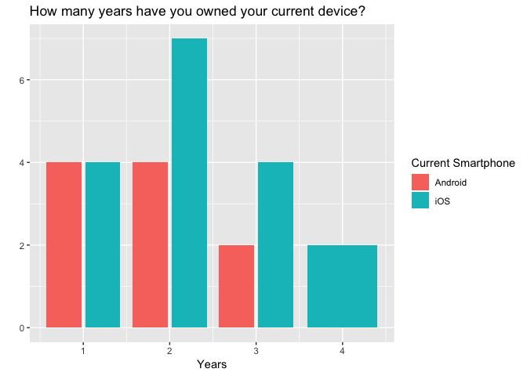
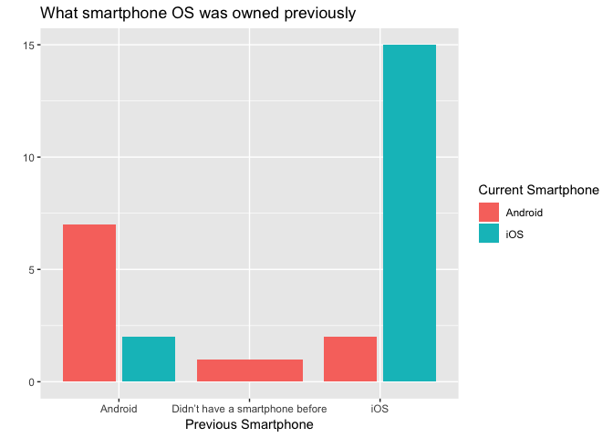
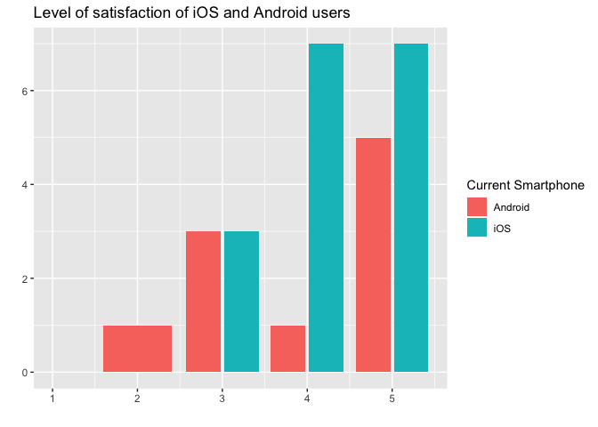
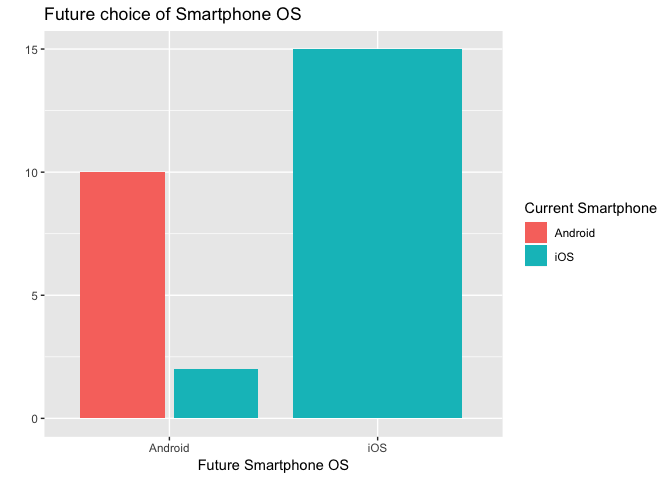
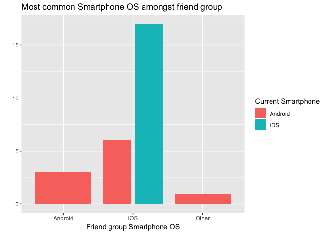
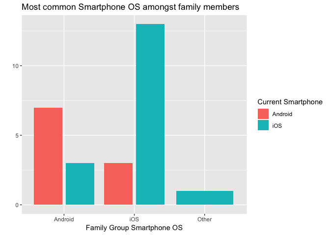
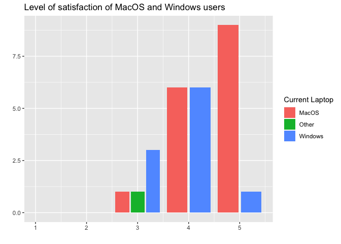
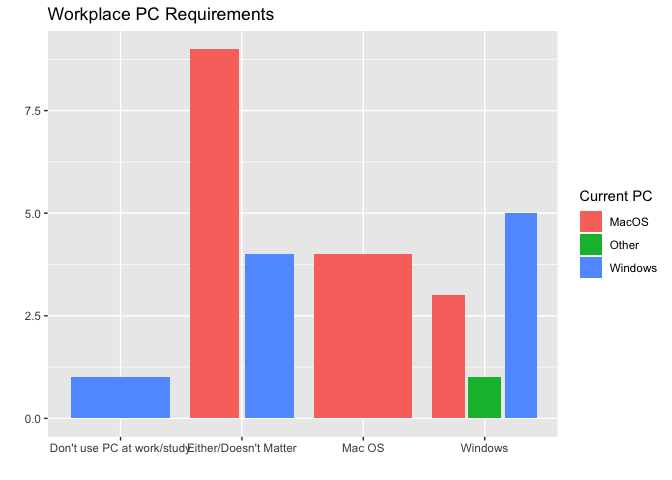
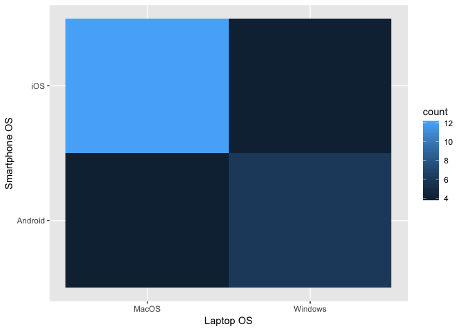

Milestone3 - Report
================

# An investigation on the association betwen peoples smartphone choices and their laptop preferences

## Background

The smartphone operating system industry is dominated by iOS and Android
and the laptop operating system industry is dominated by Mac OS and
Windows (also Linux, but for the purposes of this investigation it falls
under ‘Other’), we want to see if having there is any relation between
the phones that people own and their PC operating system choices.

Our hypothesis is that the choice of phone will influence the choice of
laptop in the individuals. For example, people with an iPhone will have
a non-negligible preference for purchasing/owning a Mac, and people with
an Android will edge towards a Windows or Linux OS.

## Survey Design

Online Survey Link:
<https://form.simplesurvey.com/f/s.aspx?s=ab0d4727-1bfa-492b-a658-603160a2d84f&lang=EN>

The survey is designed to identify the whether the choice of
individuals’ smartphone operating systems is associated with their
choice of laptops. Our main questions are asking respondents what
operating systems they use on their smartphones and laptops. Besides
these, we also ask them what their levels of satisfaction with their
smartphone and laptop operating systems are on a scale from 1 to 5,
where 1 represents “lowest satisfaction” and 5 represents “highest
satisfaction”. The rest of questions are all related to our hypothesis
and target at finding the cofounding variables.

Considering the ethics problem, our survey questions are based on the
UBC Office of Research Ethics document. All online survey data will be
stored and accessed in Canada only. In addition, no private information,
such as names, IP address, or any information that can indirectly
identify someone, will be collected in the survey.

## Reading the data

We asked our respondents a series of questions related to their
smartphones and PCs that included their level of satisfaction and the
type of OS required at the work. The columns are outlined below

  - **smartphone\_OS**: The type of smartphone that they currently own
  - **num\_smartphone\_OS**: Level of satisfaction with smartphone
  - **smartphone\_OS\_years**: Number of years they’ve owned the
    smartphone
  - **pre\_smartphone\_OS**: The smartphone that was owned before the
    current one
  - **future\_smartphone\_OS**: The smartphone they would purchase today
    if they had the choice
  - **family\_smartphone\_OS**: The smartphone OS that is most common
    amongst their family
  - **friend\_smartphone\_OS**: The smartphone OS that is most common
    amongst their friends
  - **PC\_OS**: The PC/Laptop operating system they are currently
    running
  - **num\_PC\_OS**: Level of satisfaction with PC
  - **PC\_OS\_years**: How long they’ve owned their current laptop/PC
  - **future\_PC\_OS**: The PC/Laptop OS they would purchase today if
    they had the choice
  - **workplace\_PC\_OS**: The PC/Laptop OS that is required by their
    workplace

Below, we show a snippet of the first six rows of our data, that is read
into our analysis
pipeline.

| smartphone\_OS | num\_smartphone\_OS | smartphone\_OS\_years | pre\_smartphone\_OS | future\_smartphone\_OS | family\_smartphone\_OS | friend\_smartphone\_OS | PC\_OS | num\_PC\_OS | PC\_OS\_years | future\_PC\_OS | workplace\_PC\_OS     |
| :------------- | ------------------: | --------------------: | :------------------ | :--------------------- | :--------------------- | :--------------------- | :----- | ----------: | ------------: | :------------- | :-------------------- |
| iOS            |                   5 |                     3 | iOS                 | iOS                    | iOS                    | iOS                    | MacOS  |           5 |             1 | iOS            | Either/Doesn’t Matter |
| Android        |                   3 |                     3 | iOS                 | Android                | iOS                    | iOS                    | MacOS  |           4 |             4 | iOS            | Windows               |
| iOS            |                   4 |                     2 | iOS                 | iOS                    | Android                | iOS                    | MacOS  |           4 |             1 | Other          | Mac OS                |
| iOS            |                   3 |                     2 | iOS                 | iOS                    | iOS                    | iOS                    | Other  |           3 |             1 | iOS            | Windows               |
| iOS            |                   4 |                     3 | iOS                 | iOS                    | iOS                    | iOS                    | MacOS  |           3 |             1 | iOS            | Either/Doesn’t Matter |
| Android        |                   3 |                     2 | Android             | Android                | Android                | iOS                    | MacOS  |           5 |             3 | iOS            | Either/Doesn’t Matter |

## Exploratory Analysis

First, let’s create some summary tables of the responses to see what
kind of a spread we’ve got.

#### Smartphone OS counts

| Smartphone OS | Count |
| :------------ | ----: |
| Android       |    10 |
| iOS           |    17 |

#### Laptop OS Counts

| PC OS   | Count |
| :------ | ----: |
| MacOS   |    16 |
| Other   |     1 |
| Windows |    10 |

Now, we decided to look at the **number of combinations between
smartphone and PC OS**

| Smartphone OS | PC OS   | Count |
| :------------ | :------ | ----: |
| Android       | MacOS   |     4 |
| Android       | Windows |     6 |
| iOS           | MacOS   |    12 |
| iOS           | Other   |     1 |
| iOS           | Windows |     4 |

#### Smartphones analysis

Let’s take a closer look at the Smartphones category. First, we asked
the respondents how long they’ve owned their current device for?

<!-- -->

<!-- -->

Looking at the phones that the individual owned previously, iOS users
and Android users were generally pretty consistent with sticking to
their platforms.

Looking at the level of satisfaction that iOS users reported and the
level of satisfaction that Android users reported side-by-side:

<!-- -->

There appears to be a little more dissatisfaction with their current
smartphone OS amongst the Android group. The iOS group on the other hand
is robust with their satisfaction with their phones OS; with almost all
responses in the 4 or 5 range.

Let’s see if this translates into what future phones they might
purchase.

<!-- -->

Interestingly enough, Android saw a slight increase in the desired
smartphone OS category compared to iOS. None of the Android users said
they would purchase an iOS device next although the reverse is not true.

<!-- -->

Amongst iOS users, all of them reported to have iOS devices as the most
common device amongst their friend groups. On the other hand, Android
users were all over the place with some reporting iOS and 1 individual
reporting ‘other’.

<!-- -->

Similarly to the friend group, most iOS users reported iOS devices being
most common amongst their family members. Android users reported both
iOS and Android devices as the most common devices amongst their family
member groups.

#### Laptop OS

Now let’s take a closer look at the Laptop OS category

Looking at the level of satisfaction that MacOS and Windows users
reported out of five, side-by-side:

<!-- -->

Similarly to the Android group above, the Windows group shows a little
bit of a lower satisfaction overall with their current OS than the MacOS
group. Many MacOS users reported a 5/5 satisfaction with their product.

<!-- -->

Users reported their PC workplace requirements and interestingly enough,
even in offices/workplaces where Windows was required, some users still
had MacOS as their PC.

#### Combinations of Smartphone,Laptop OS

Finally, looking at a bin2d graph of the current smartphone platforms
vs. the current laptop platforms.

<!-- -->

Clearly as the iOS, MacOS syndicate is the most represented, it is the
lightest on the graph. Our outliers, the cross-platform users, are
poorly represented amongst this sample, but still non-negligible.

## Statistical Analysis

Contingency table
for

``` r
(Contingency_smartphone<-table(smart_survey$smartphone_OS,smart_survey$PC_OS))
```

    ##          
    ##           MacOS Other Windows
    ##   Android     4     0       6
    ##   iOS        12     1       4

``` r
(chisq <- chisq.test(Contingency_smartphone))
```

    ## Warning in chisq.test(Contingency_smartphone): Chi-squared approximation
    ## may be incorrect

    ## 
    ##  Pearson's Chi-squared test
    ## 
    ## data:  Contingency_smartphone
    ## X-squared = 3.8435, df = 2, p-value = 0.1463

## Conclusion

Based on the visualizations above, we observed that:

1.  Android users are little more dissatisfaction with their current
    smartphone operating system.
2.  iOS users are robust with their current smartphone operating system.
3.  Interestingly, seems like some iOS users are willing to switch to
    Android in the future.
4.  For laptop operating system, the Windows users show a little bit of
    a lower satisfaction overall with their current operation system
    than the MacOS group.
5.  Just based on the survey results, the combination of iOS smartphone
    and MacOS laptop is the most represented.

Based on the statistical analysis, we observed that:

With a sample size of 27, the Pearson’s Chi-squared test of independance
show that there is no significant association between the smartphone
choices and laptop preferences with a p-value of 0.1463. The test
statistic was 3.8435 with 2 degree of freedom. Base on the contgency
table, we see that there is 17 iOS user vs 10 android user. Also, there
is 16 MacOS user vs 10 Windows user, and 1 user wih an alternative
computer operating system.

## Limitations

The survey still has a number of limitations that we can improve in the
future:

  - Due to the survey platform restrictions, it limits the number of
    responses up to 27. In other words, the dataset is very small for us
    to come up with a convincing result. As the sample size is a big
    factor in the chi-square test of independence, our result, there is
    no association between choice of smartphone os and that of laptop
    OS, could be more meaningful if we can increase the sample size in
    the future.
  - Survey respondents are limited to the 2018/19 MDS cohorts who have
    already been required to have their own laptop with certain hardware
    requirements before entering to the program. Therefore, the analysis
    results may be imbalanced between MacOS and Windows operating
    systems.
  - We should provide more clear descriptions for the satisfaction
    questions as different persons have various standards to measure the
    satisfaction levels.

## Future Improvements

In the future, we may use another survey platform which has no
limitation on the number of responses. Additionally, we will expand the
survey responding groups instead of focusing on MDS cohorts. We might
also include some extreme cases such as elders, low income individuals
and etc. Detailed descriptions for each question will also be attached
beside of the questions so that the respondents have the opportunities
to further understand the standards for each question.
